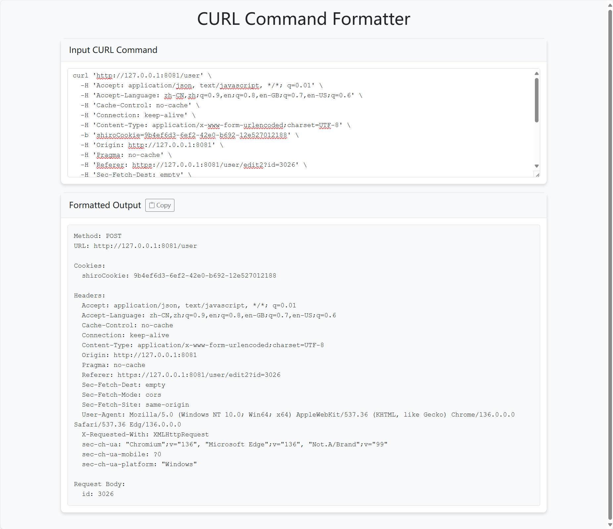

# CURL Command Formatter

## 项目简介

CURL Command Formatter 是一个前端 Web 工具，帮助用户将复杂的 `curl` 命令格式化为结构化、易读的内容，便于理解和调试 HTTP 请求。

## 功能特性
- 支持解析 curl 命令中的 URL、请求方法、请求头、Cookie、查询参数、请求体等信息
- 实时格式化输入，自动显示格式化结果
- 一键复制格式化输出
- 错误提示友好
- 响应式美观界面，基于 Bootstrap 5 和 Bootstrap Icons

## 使用方法
1. 打开 `index.html` 文件，即可在浏览器中使用本工具，无需后端依赖。
2. 在页面的输入框粘贴你的 curl 命令，格式化结果会自动显示在下方。
3. 点击"Copy"按钮可一键复制格式化内容。

## 界面截图

下图展示了 CURL Command Formatter 的前端界面：



## 依赖说明
- [Bootstrap 5.1.3](https://getbootstrap.com/)（css/bootstrap.min.css）
- [Bootstrap Icons 1.7.2](https://icons.getbootstrap.com/)（css/bootstrap-icons.css 及 fonts）
- 依赖文件已包含在本地，如需重新下载可使用下方脚本。

## 资源下载脚本
本项目提供 `download_assets.py` 脚本用于自动下载 Bootstrap 及 Bootstrap Icons 相关依赖。

### 使用方法
1. 确保已安装 Python 3 和 `requests` 库：
   ```bash
   pip install requests
   ```
2. 运行脚本：
   ```bash
   python download_assets.py
   ```

脚本会自动下载依赖到 `css/` 及 `css/fonts/` 目录。

## 目录结构
```
├── index.html           # 主页面
├── js/
│   ├── app.js           # 页面交互逻辑
│   └── curl-formatter.js# curl命令解析与格式化核心
├── css/
│   ├── bootstrap.min.css
│   ├── bootstrap-icons.css
│   ├── style.css        # 自定义样式
│   └── fonts/           # Bootstrap Icons 字体
├── download_assets.py   # 依赖下载脚本
```

## 许可协议
本项目仅用于学习和交流，Bootstrap 及 Bootstrap Icons 遵循其各自的 MIT 协议。 